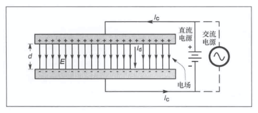
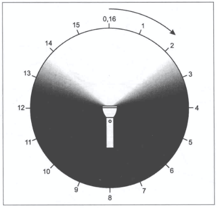

# 天线基本理论
## 电磁场与电磁波
### 电场与磁场
#### 传导电流与位移电流
交流电源与电容器相连接，导线上为传导电流（$I_c$），两极板之间为假想的位移电流（$I_d$）。

### 电磁波
电场与磁场是耦合的，是电磁波实体的两个方面，二者共同构成单一实体——电磁波——由发射天线中运动的电子产生。

#### 传播速度和波长
$$
λ=c/f
$$
真空中的$λ=299.7925*10^8/f$
波在媒介中的传播速度与波在真空中的传播速度的比值称为该媒介的速度系数（VF），介于0和1之间。空气中频率低于30MHz的波，传播速度的减小可忽略不计。在甚高频（VHF）及更高频率上，媒介的温度和湿度对通信范围有递增作用。
#### 波的相位和极化
相位是一个波形内和波形之间相对时间的测量。下图中A、B、C三点同相。

[天线设计理论第一期：十分钟掌握天线/电磁波的极化](https://www.bilibili.com/video/BV16a4y1p7WQ)
**区分相位和极化**
极化仅是一个约定，即给波指定正向和负向或者惯例。反转馈线中的引线仅会颠倒信号的极化方向，并不改变相位。
#### 场的强度
离开发射天线一定距离的电磁波强度用场强来表示，这就是电场强度。
电磁波的强度由波阵面所在平面上电力线上两点之间的电压来衡量。标准电磁场强度的测量是1m长的线上所产生的电压，单位$V/m$。
#### 波的衰减
电场强度和功率密度之间的关系类似于普通电路中电压和功率的关系。二者由自由空间中的阻抗所联系，约为$337Ω$。
$1V/m$电场强度对应功率密度为：
$$
p=E^2/Z=1(V/m)^2/337Ω=2.65mW/m^2
$$
实际中，电磁波衰减要大得多。
* 波不在真空中传播
* 接收天线很少被放置在有清晰视线的位置
* 视距之外的通信是使得电磁波沿地球曲面弯曲的方式

## 天线阻抗
### 辐射阻抗
加在天线上的功率通常通过两种途径消耗：
* 电磁波的形式辐射
* 热能的形式在导线和附近电介质中消耗掉
天线总功率等于$I^2(R_0+R)$，其中$R$为总的损耗电阻，$R_0$为辐射阻抗。
### 电流和电压的分布

因为天线存在阻抗，电压最小值不是0。
### 馈电点阻抗
天线的第一个重要特征是馈电点的阻抗。
两种形式的阻抗：**自阻抗**和**互阻抗**
#### 自阻抗
馈电点电压和电流的比。
如果电压与电流同相，则自阻抗是纯电阻，即电抗部分为零，此时天线谐振。
除开真正谐振的频点上，天线的电压与电流的相位不同，自阻抗非纯电阻。
#### 互阻抗
又称耦合阻抗，由于附近导体的寄生效应产生。
是导体中电压和另一个（耦合）导体中的电流的比。
互阻抗会使有高度方向性的天线的方向图产生扭曲，也会改变馈电点处的阻抗。

## 天线方向性和增益
### 各向同性辐射
各向同性辐射体，向所有方向辐射的能量相等。
### 方向性和辐射方向图
将天线类比为手电，测量其在漆黑房间中发出光的强度，并用平滑曲线画出。

### 近场和远场
发生源和接收天线之间相互耦合的区域叫做近场区区域，也称感应场，意思是在这个区域中，磁场通常相对于电场具有支配地位。这是天线像一个非常大的[集总参数电路](https://zh.wikipedia.org/zh-sg/集總電路)的电感或电容，在近区场存储着能量而非向空间发射。
辐射远区场把电磁波传播开来。全部能量在磁场与电场间均匀分配。
广泛认为，辐射近区场和辐射远区场的界限定义为：
$$
D=(2L^2)/λ
$$
其中L为天线最大物理尺寸。
为准确测量天线的辐射场，必须把测量仪器放在离待测天线数个波长之外的地方。

### 辐射方向图的类型

整个波瓣中辐射强度最大强的那一瓣称之为主瓣，其余称之为旁瓣。以下两种情况除外：
* 特别注明的一些较大辐射强度
* 几个图形之间的对比
主瓣波峰所在外环的位置为参考点。主瓣峰值可以位于任意角度。
#### 方位角和仰角方向图

#### $E$面和$H$面方向图
$E$面，天线电场平行平面的辐射方向图。
$H$面，天线磁场平行平面的辐射方向图。
两场方向相互垂直 -> $E$面和$H$面辐射方向图所在平面相互垂直。
### 方向性和增益
最大功率密度与整个假想球体表面的平均功率密度之比衡量天线方向性。
$$
D=p/p_{av}
$$
其中$D$称为“方向系数”，$p$为假想球体表面最大功率密度，$p_{av}$为平均功率密度。
天线增益与天线方向系数密切相关。系数不关心天线中的任何功率损失，因此计算增益时需要减去损失的功率。一般的，损失是一个固定百分比，因此天线增益为：
$$
G=kp/p_{av}=kD
$$
其中$G$为天线增益（使用功率比表示），$D$为方向系数，$k$为天线效率（辐射功率除以输入功率）。
对于业余无线电使用的天线，一般效率很高，可近似认为$G=D$
天线方向图主瓣宽度，常用的衡量天线方向性的指标，宽度为两个半功率点（$-3dB$）之间角度，常称为“半功率波束宽度”。
当天线副瓣相对主瓣较小，在电阻上的损耗也较小时可用下述公式估算天线相对于各向同性天线的增益。
$$
G\approx41253/H_{3dB}*E_{3dB}
$$

## 天线极化
天线极化方向为电场极化方向。
天线阵中同时使用水平和垂直极化单元，并按同相关系辐射电磁波时，极化方向与每个单元对辐射电磁波的贡献有关。
当天线阵的水平极化和垂直极化单元采用非同相馈电，此时极化方式为椭圆极化。

## 其他天线特征
### 收发互异性
谐振天线在接受上的许多特性和参数与其发射时的一样。负载阻抗与天线阻抗需要匹配，以使天线收发时都可以传输最大功率。
但是，在通过电离层反射的长距离收发中，天线的收发不总能完全互易。
电磁波的极化在电离层中通常会发生改变。无论发射天线的极化方式，到达接收天线的电磁波趋于椭圆极化。
### 天线带宽
一般指天线工作频率范围。
### 频率缩放
任何天线尺寸的设计都可按照另一频率进行尺寸缩放。
$$
D=(f_1/f_2)*d
$$
其中$D$为缩放后尺寸，$d$为原尺寸，$f_1$为原天线工作频率，$f_2$为缩放后天线工作频率。
### 有效辐射功率
发射机输出功率减去传输线衰减和所有连接器损耗，再加上天线增益。

## 分贝简介
使用功率比：$dB=10log_{10}{P_1/P_2}$
使用电压比：$dB=20log_{10}{V_1/V_2}$
当$P_2$和$V_2$是一些固定的参考值，所添加的字母“$dB$”是关于参考值的分贝。在业余无线电中常碰到$dBm$($P_2=1mW$)和$dBμV$($V_2=1μV$)。